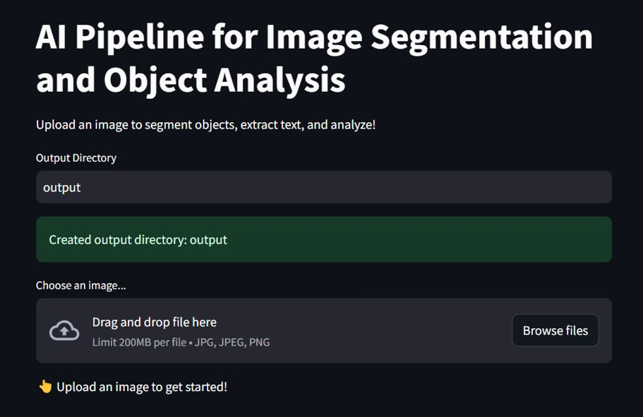
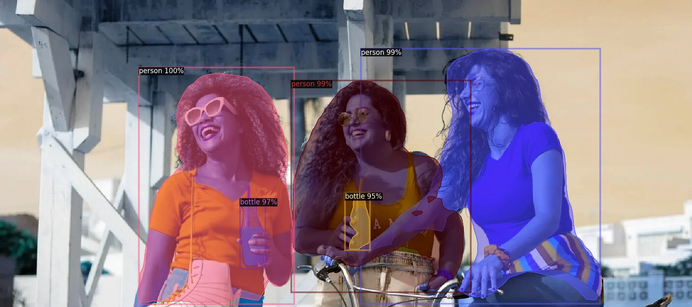
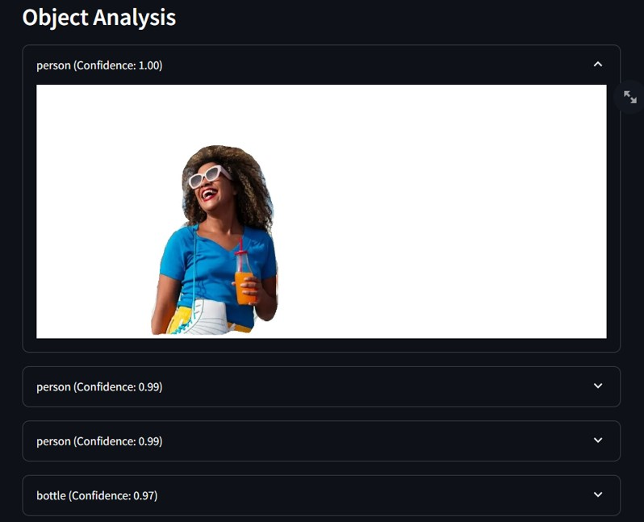
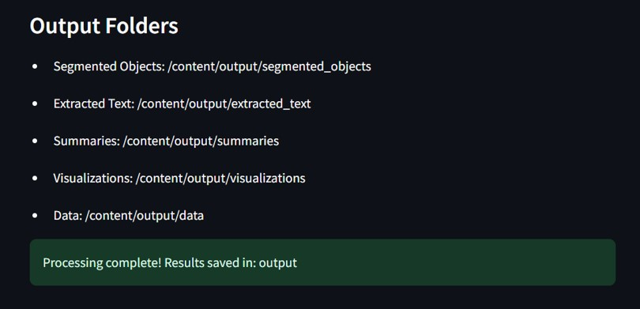

# AI Pipeline for Image Segmentation and Object Analysis

## Project Overview

This project involves building an AI pipeline to process input images, segment, identify, and analyze objects within them. The pipeline is designed to output a summary table with mapped data for each object. The entire process is divided into several steps, each focusing on a specific aspect of image analysis.

## Objectives

- Segment objects within an input image.
- Extract and store each segmented object separately with unique identifiers.
- Identify and describe each object.
- Extract text or data from each object.
- Summarize the nature and attributes of each object.
- Map all extracted data and attributes to each object.
- Generate a final output with the original image and a table summarizing all the data.

## Steps and Deliverables

### Step 1: Image Segmentation
- **Task:** Segment all objects within an input image.
- **Deliverables:**
  - Code to implement or use a pre-trained model (e.g., Mask R-CNN, DETR) for image segmentation.
  - Visual output showing segmented objects within the image.
- **Suggested Tools/Resources:** PyTorch, TensorFlow, pre-trained segmentation models.

### Step 2: Object Extraction and Storage
- **Task:** Extract each segmented object from the image and store separately with unique IDs.
- **Deliverables:**
  - Code to extract and save each segmented object as a separate image.
  - Metadata including unique ID for each object and a master ID for the original image.
  - Storage of object images and metadata in a file system or database.
- **Suggested Tools/Resources:** OpenCV, PIL, SQLite, or any preferred database.

### Step 3: Object Identification
- **Task:** Identify each object and describe what they are in the real world.
- **Deliverables:**
  - Code to implement or use a pre-trained model (e.g., YOLO, Faster R-CNN, CLIP) for object identification and description.
  - Document containing identified objects and their descriptions.
- **Suggested Tools/Resources:** Pre-trained object detection models, CLIP.

### Step 4: Text/Data Extraction from Objects
- **Task:** Extract text or data from each object image.
- **Deliverables:**
  - Code to implement or use a pre-trained model (e.g., Tesseract OCR, EasyOCR) for text extraction.
  - Document containing extracted text/data for each object.
- **Suggested Tools/Resources:** OCR tools, PyTorch, TensorFlow.

### Step 5: Summarize Object Attributes
- **Task:** Summarize the nature and attributes of each object.
- **Deliverables:**
  - Code to generate a summary of the nature and attributes of each object.
  - Document containing summarized attributes for each object.
- **Suggested Tools/Resources:** NLP models, summarization algorithms.

### Step 6: Data Mapping
- **Task:** Map all extracted data and attributes to each object and the master input image.
- **Deliverables:**
  - Code to map unique IDs, descriptions, extracted text/data, and summaries to each object.
  - Data structure (e.g., JSON, database schema) representing the mapping.
- **Suggested Tools/Resources:** JSON, SQL, any preferred database.

### Step 7: Output Generation
- **Task:** Output the original image along with a table containing all mapped data for each object in the master image.
- **Deliverables:**
  - Code to generate the final output image with annotations.
  - Table summarizing all data mapped to each object and the master image.
  - Final visual output showing the original image with segmented objects and an accompanying table.

## Setup Instructions

1. **Clone the repository:**
   ```bash
   git clone https://github.com/your-repo/ai-pipeline-image-segmentation.git
   cd ai-pipeline-image-segmentation
   ```

2. **Install dependencies:**
   ```bash
   pip install -r requirements.txt
   ```

3. **Run the pipeline:**
   ```bash
   python run_pipeline.py --input_image path/to/image.jpg
   ```

4. **Output:**
   - The segmented objects will be saved in the `output/` directory.
   - Metadata, summaries, and the final output table will be generated and saved in the `output/` directory.
  
## Streamlit Application
The application is developed using Streamlit, allowing users to interactively upload images, view segmented objects, and see the confidence scores for object detection. The application outputs the original image with segmentation overlays and a list of detected objects with confidence scores.

- Streamlit UI:

  

  
- Visual Output:
  
  

  

  

## Conclusion

This project demonstrates how to build an end-to-end AI pipeline for image segmentation and object analysis, utilizing a range of deep learning and image processing techniques. The final output provides a comprehensive analysis of objects within an image, complete with mapped data and visual representations.
